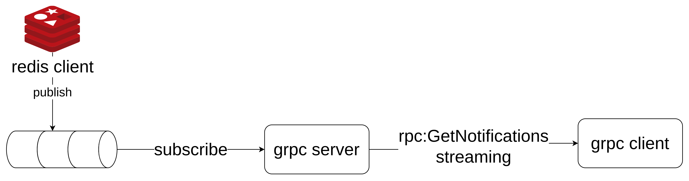

# golang-sample-with-grpc-server-streaming

This example is for demo how to implementation grpc server streaming with golang

## structure



## grpc server

```golang
package main

import (
	"context"
	"log"
	"log/slog"
	"net"
	"os"
	"os/signal"
	"syscall"
	"time"

	"github.com/leetcode-golang-classroom/golang-sample-with-grpc-server-streaming/internal/config"
	"github.com/leetcode-golang-classroom/golang-sample-with-grpc-server-streaming/internal/service/notification"
	"github.com/leetcode-golang-classroom/golang-sample-with-grpc-server-streaming/proto"
	"github.com/redis/go-redis/v9"
	"google.golang.org/grpc"
)

func main() {

	// setup signal
	ctx, cancel := signal.NotifyContext(context.Background(), os.Interrupt,
		syscall.SIGTERM, syscall.SIGINT)
	defer cancel()

	// construct gRPC service
	listener, err := net.Listen("tcp", config.AppConfig.GRPCAddress)
	if err != nil {
		log.Fatalf("failed to listen: %v", err)
	}
	var opts []grpc.ServerOption
	grpcServer := grpc.NewServer(opts...)
	// setup redis client
	redisOpts, err := redis.ParseURL(config.AppConfig.RedisURL)
	if err != nil {
		log.Fatal(err)
	}
	redisClient := redis.NewClient(redisOpts)
	handler := notification.NewHandler(redisClient)
	proto.RegisterNotificationServiceServer(grpcServer, handler)
	slog.Info("listening on " + config.AppConfig.GRPCAddress)
	go func() {
		if err = grpcServer.Serve(listener); err != nil {
			log.Fatalf("failed to serve: %v", err)
		}
	}()

	// listen for stop signal
	<-ctx.Done()
	_, stop := context.WithTimeout(ctx, time.Second*10)
	slog.Info("stopping server, wait for 10 seconds to stop")
	grpcServer.GracefulStop()
	defer stop()
}

```

## client

```golang
package main

import (
	"context"
	"encoding/json"
	"fmt"
	"io"
	"log"
	"os"
	"os/signal"
	"syscall"

	"github.com/leetcode-golang-classroom/golang-sample-with-grpc-server-streaming/internal/config"
	"github.com/leetcode-golang-classroom/golang-sample-with-grpc-server-streaming/internal/service/notification"
	"github.com/leetcode-golang-classroom/golang-sample-with-grpc-server-streaming/proto"
)

func main() {
	// setup signal
	ctx, cancel := signal.NotifyContext(context.Background(), os.Interrupt,
		syscall.SIGTERM, syscall.SIGINT)
	defer cancel()
	// setup gRPC client and receive notification
	client, err := notification.NewClient(config.AppConfig.GRPCAddress)
	if err != nil {
		log.Fatal(err)
	}

	// ctx := context.Background()
	stream, err := client.GetNotifications(ctx, &proto.NotificationRequest{
		UserId: "123",
	})

	if err != nil {
		log.Fatal(err)
	}

	for {
		notification, err := stream.Recv()
		if err == io.EOF { // no more data to read
			break
		}
		if err != nil {
			log.Fatalf("failed to read notification: %v", err)
		}
		b, err := json.MarshalIndent(notification, "", "\t")
		if err != nil {
			log.Fatal(err)
		}
		fmt.Println(string(b))
	}
}

```

## publisher

```golang
package main

import (
	"context"
	"fmt"
	"log"
	"log/slog"
	"os"
	"os/signal"
	"syscall"
	"time"

	"github.com/leetcode-golang-classroom/golang-sample-with-grpc-server-streaming/internal/config"
	"github.com/redis/go-redis/v9"
)

func main() {
	// setup signal
	ctx, cancel := signal.NotifyContext(context.Background(), os.Interrupt,
		syscall.SIGTERM, syscall.SIGINT)
	defer cancel()
	// publish data to the notification channel via redis
	opts, err := redis.ParseURL(config.AppConfig.RedisURL)
	if err != nil {
		log.Fatal(err)
	}
	redisClient := redis.NewClient(opts)
	channelName := fmt.Sprintf("notifications/%s", "123")
	ticker := time.NewTicker(time.Second * 5)
	for {
		select {
		case <-ctx.Done():
			redisClient.Close()
			log.Println("shutting down")
			return
		case t := <-ticker.C:
			dataToSend := fmt.Sprintf("New notication %s", t.String())
			slog.Info("starting sending data: " + dataToSend)
			if cmd := redisClient.Publish(ctx, channelName, dataToSend); cmd.Err() != nil {
				log.Fatal(cmd.Err())
			}

		}
	}

}

```